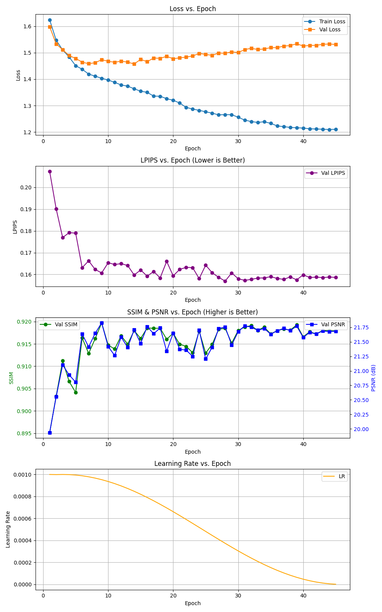

# 🍔 Food Colorization using Deep Networks: Grayscale to Vibrant Color
### *Advanced Deep Learning Colorization using U-Net & ResNet-50*

<p align="center">
  
</p>

<p align="center"> 
Final project for the Technion's EE Deep Learning course (046217)
<p align="center"> 

---
## 📑 Table of Contents

- [📖 Introduction](#-introduction)
- [🛠️ Model Architecture & Methodology](#️-model-architecture--methodology)
- [📈 Training Summary](#️training-summary)
- [🖼️ Results Gallery](#️-results-gallery)
- [📂 Repository Contents](#-repository-contents)
- [💻 Setup & Usage](#-setup--usage)

---

## 📖 Introduction
This project implements a colorization pipeline using a **U-Net** architecture with a **ResNet-50** backbone, trained on the **Food-101** dataset. By leveraging the CIELAB color space, the model learns to predict the $a$ and $b$ (color) channels given the $L$ (luminance) channel.

### 🎯 Project Highlights
* **High-Fidelity Colorization**: Uses annealed mean decoding ($T=0.42$) for vibrant results.
* **Video Capability**: Successfully processes video sequences frame-by-frame.
* **Smart Architecture**: Combines pre-trained ResNet-50 features with U-Net skip connections.

---

## 🛠️ Model Architecture & Methodology

The core of this project is a **Quantized Color Class Prediction** model. Instead of predicting a single color value (which leads to "muddy" gray results), the model predicts a probability distribution over 259 discrete color bins.

| Stage | Description |
| :--- | :--- |
| **Preprocessing** | Lab color space conversion, color quantization, and rare-class rebalancing. |
| **Encoder** | Modified **ResNet-50** (accepting 1-channel grayscale input). |
| **Decoder** | Symmetric upsampling path with **Skip Connections** to preserve edges. |
| **Inference** | Annealed Mean decoding to balance color saturation and realism. |
<p align="center">

<p align="center">
  
---

## 📈 Training Summary

Training converges smoothly with stable optimization. While validation loss increases at later epochs, perceptual quality (LPIPS) and image fidelity (SSIM, PSNR) continue to improve and stabilize. We therefore use the epoch 39 checkpoint, which provides the best visual and perceptual results in practice.

<p align="center">
  
</p>
---

## 🖼️ Results Gallery

### Side-by-Side Test Comparisons
Below are several examples from the test set showing the input grayscale, our model's prediction, and the ground truth.

<p align="center">
  <table>
    <tr>
      <td></td>
      <td></td>
    </tr>
  </table>
</p>

---

## 📂 Repository Contents

### Source Code (`src/`)
* **`data/`** - Dataset and data loading
  * `datasets.py` - ColorizationFood101 dataset with soft-encoding
  * `transforms.py` - Custom image transformations
  * `loaders.py` - DataLoader creation
* **`models/`** - Model architectures
  * `unet_resnet50.py` - Configurable U-Net with ResNet encoder
  * `blocks.py` - Reusable building blocks
  * `losses.py` - Loss functions
* **`training/`** - Training infrastructure
  * `trainer.py` - Training orchestration
  * `logger.py` - Progress logging
  * `checkpoint.py` - Model checkpointing
* **`utils/`** - Utility functions
  * `color_utils.py` - Color space conversions
  * `visualization.py` - Inference and visualization helpers

### Scripts (`scripts/`)
* `train.py` - Main training entry point

### Configuration (`configs/`)
* `default.yaml` - Base configuration with model architecture and hyperparameters

### Notebooks (`notebooks/`)
* `data_and_preprocess.ipynb` - Data preparation and preprocessing
* `visualization.ipynb` - Inference and visualization tools

---

## 💻 Setup & Usage
### 📌 Overview
This repository implements image colorization on **Food-101** using a **U-Net decoder with a ResNet50 encoder**, trained in LAB color space with **soft-encoded ab bins**.

📂 Main components:
- `src/` – Modular source code (data, models, training, utils)
- `scripts/train.py` – Training entry point
- `configs/` – YAML configuration files
- `notebooks/` – Jupyter notebooks for preprocessing and visualization

### 📥 1) Clone the repository
```bash
git clone https://github.com/OmerBibi/Food101-Image-Colorization-with-U-Net-ResNet50
cd Food101-Image-Colorization-with-U-Net-ResNet50
```
⚠️ Important: model weights use Git LFS

This repository stores trained model weights using Git LFS.
If you don't have Git LFS installed, the weights will not be downloaded correctly.

Option A: install Git LFS (recommended):

- Install Git LFS: https://git-lfs.com

- Run once after install:
```bash
git lfs install
```
- Then clone the repo as usual.

Option B: download weights manually:

If you already cloned without Git LFS, you can:

- Go to the repository in your browser

- Navigate to the weights files (`*.pt`)

- Download them manually and place them in the correct folders

If the weights files look very small (a few KB), Git LFS is not set up correctly.

### 🐍 2) Environment setup (recommended)
```bash
conda create -n foodcolor python=3.8 -y
conda activate foodcolor
```

### 📦 3) Install dependencies
```bash
pip install -e .
```
⚠️ Notes:
* For GPU training, install a CUDA-enabled PyTorch build matching your CUDA version.
### 🗂️ 4) Folder structure (important)
The code expects the following layout:
```
Food101-Image-Colorization-with-U-Net-ResNet50/
├─ src/                    # Source code modules
├─ scripts/                # Training scripts
├─ configs/                # Configuration files
├─ notebooks/              # Jupyter notebooks
├─ artifacts/
│  └─ food101_step10_sigma5_T042/
│     ├─ ab_centers_k259.npy
│     ├─ ab_weights_k259.npy
│     └─ train_runs/
│        └─ v2_45_epoch/
│           └─ checkpoints/
│             └─ best_ep009_loss1.4589.pt
│           └─ strips/
└─ data/
```
✅ Make sure the `artifacts/food101_step10_sigma5_T042/` folder exists and contains the required .npy files and checkpoints.

### 🍔 5) Download Food-101 dataset
Run all cells of: `notebooks/data_and_preprocess.ipynb`

⬇️ This will download Food-101 into the data/ directory.

💡 Alternative: running the training script will also trigger the download automatically if the dataset is missing.

### 🚀 6) Training
To train or retrain the model:
```bash
python scripts/train.py
```

With custom configuration:
```bash
python scripts/train.py --config configs/default.yaml
```

What happens:
* Food-101 is split into train / validation
* RGB images are converted to LAB
* ab channels are soft-encoded using KNN
* Encoder is frozen for warmup, then unfrozen
* Best checkpoints are saved automatically
* Visual diagnostics are written to:
  `train_runs/.../viz/` , `train_runs/.../strips/consistency_filmstrip.png`

### ⚙️ 7) Configuration
Modify `configs/default.yaml` to adjust:
* **Training hyperparameters**: batch size, learning rate, epochs
* **Model architecture**: encoder (resnet18/34/50/101), decoder channels, skip connections
* **Data augmentation**: resize size, crop size, horizontal flip
* **Paths and directories**: data location, output paths

Example configuration sections:
```yaml
model:
  encoder: "resnet50"              # Options: resnet18, resnet34, resnet50, resnet101
  decoder_channels: [1024, 512, 256, 128, 64]
  skip_connections: true

training:
  batch_size: 64
  epochs: 45
  lr_decoder: 0.001
  lr_encoder: 0.0001
```

### 🎨 8) Inference and visualization
Use `notebooks/visualization.ipynb`

Typical steps inside the notebook:

1. Load ab_centers_k259.npy

2. Build the model with num_classes = 259

3. Load a checkpoint (best_epXXX_*.pt)

4. Run inference on grayscale images

5. Decode logits using annealed mean

6. Convert LAB → RGB and visualize results

🎛️Important inference parameter:

`ANNEAL_T = 0.42`
Lower values give sharper colors but may introduce artifacts.

### 🛠️ 9) Customization
You can modify:

- ⚙️ **Training hyperparameters** in `configs/default.yaml`
  - Batch size, learning rates, epochs, weight decay
- 🏗️ **Model architecture** in `configs/default.yaml`
  - Encoder backbone (ResNet18/34/50/101)
  - Decoder channel dimensions
  - Skip connections on/off
- 🧪 **Preprocessing logic** in `notebooks/data_and_preprocess.ipynb`
- 🔢 **Number of ab bins (K)**
  - ⚠️ Changing K requires regenerating centers and weights and retraining

### ❗ 10) Common issues
- 📁 Missing artifacts - Check folder name: food101_step10_sigma5_T042

- 🧯 CUDA out-of-memory - Reduce batch size

- 🎭 Desaturated or unstable colors - Tune ANNEAL_T during inference
  
---
*Inspired by the "Colorful Image Colorization" paper (Zhang et al.) and built for the Food-101 Challenge.*
