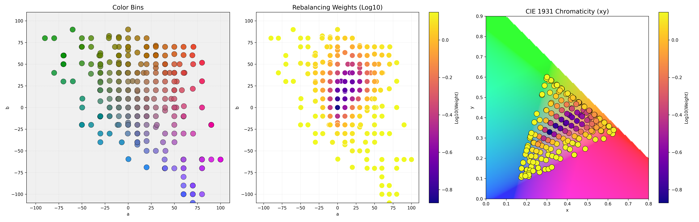
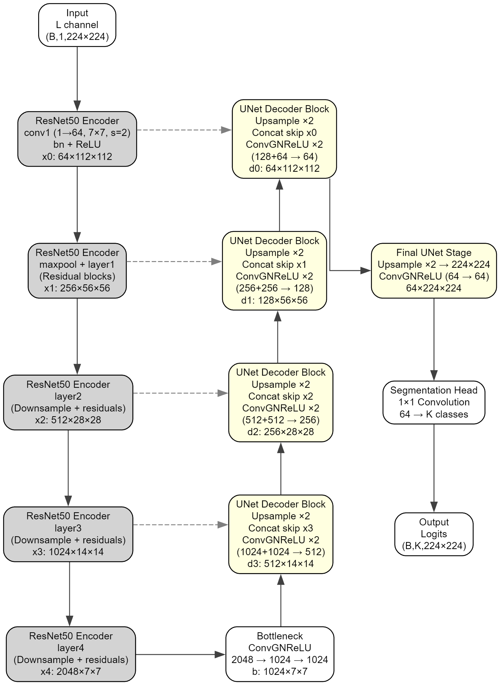
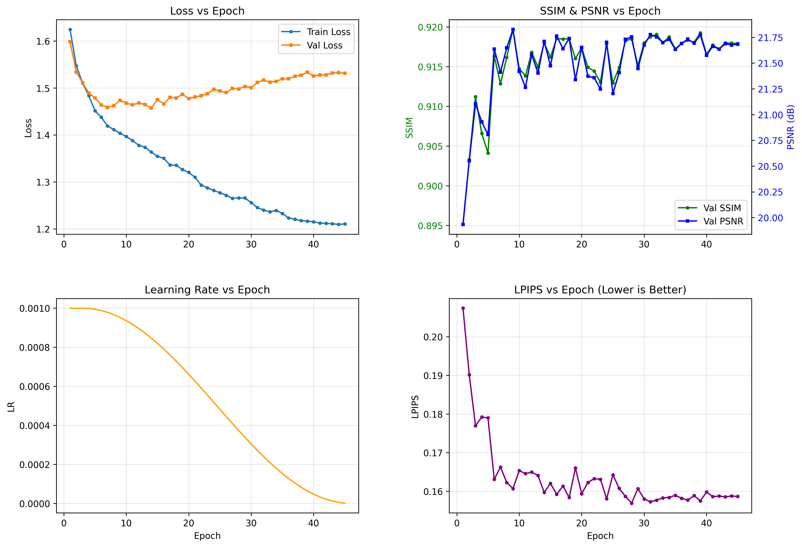
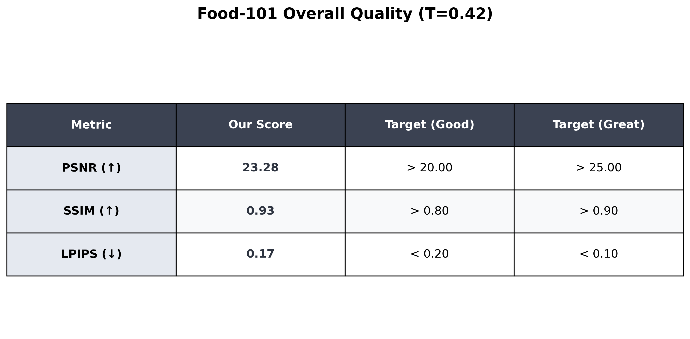

# 🍔 Food Colorization using Deep Networks: Grayscale to Vibrant Color
### *Advanced Deep Learning Colorization using U-Net & ResNet-50*

<p align="center">
  
</p>

<p align="center"> 
  <i>Video generated by Google's Nano Banana, and inferenced by our model</i> <br> <br>
Final project for the Technion's EE Deep Learning course (046217)
<p align="center"> 
  
---

# ⚠️ **Important**

This repository uses **Git LFS** for model checkpoints.
If you skip Git LFS, inference will silently break.

 Install Git LFS: https://git-lfs.com  
 Then, initialize it:
  ```bash
  git lfs install
  ```

## 📑 Table of Contents

- [📖 Introduction](#-introduction)
- [🎨 Color Distribution & Class Rebalancing](#-color-distribution--class-rebalancing)
- [🛠️ Model Architecture & Methodology](#️-model-architecture--methodology)
- [📈 Training Summary](#-training-summary)
- [🖼️ Results Gallery](#️-results-gallery)
- [📂 Repository Contents](#-repository-contents)
- [💻 Setup & Usage](#-setup--usage)

---

## 📖 Introduction
This project implements a colorization pipeline using a **U-Net** architecture with a **ResNet-50** backbone, trained on the **Food-101** dataset. By leveraging the CIELAB color space, the model learns to predict the $a$ and $b$ (color) channels given the $L$ (luminance) channel.

### 🎯 Project Highlights
* **High-Fidelity Colorization**: Uses annealed mean decoding ($T=0.42$) for vibrant results.
* **Video Capability**: Successfully processes video sequences frame-by-frame.
* **Smart Architecture**: Combines pre-trained ResNet-50 features with U-Net skip connections.

---
## 🎨 Color Distribution & Class Rebalancing

To prevent the model from producing only dull or "brownish" images (a common issue called "color collapse"), we use a custom weighting strategy during training.



What this visualization shows:

- Color Bins (Left): This shows the 259 bins we found by applying K-means on the Food101 dataset. Notice the huge cluster in the center - these are the common browns, grays, and whites found in most food.

- Rebalancing Weights (Middle): This plot shows the "boost" we give to different colors. Rare colors (such as bright blues and greens) are assigned much higher weights (represented by bright yellow dots) to ensure the model doesn't overlook them.

- CIE Chromaticity (Right): This maps our weights onto the full range of human vision. It proves that the highest training priority is given to vibrant, "spectral" colors at the edges, while common neutral tones are given lower priority.

---

## 🛠️ Model Architecture & Methodology

The core of this project is a **Quantized Color Class Prediction** model. Instead of predicting a single color value (which leads to "muddy" gray results), the model predicts a probability distribution over 259 discrete color bins.

| Stage | Description |
| :--- | :--- |
| **Preprocessing** | Lab color space conversion, color quantization, and rare-class rebalancing. |
| **Encoder** | Modified **ResNet-50** (accepting 1-channel grayscale input). |
| **Decoder** | Symmetric upsampling path with **Skip Connections** to preserve edges. |
| **Inference** | Annealed Mean decoding to balance color saturation and realism. |
<p align="center">

<p align="center">
  

### ✍ Key Design Choices

#### Why classification instead of regression
Image colorization is inherently **multimodal**. The same grayscale texture can map to many valid colors
(for example, red vs green apples, or rare vs well-done meat).  
Direct regression with an L2 loss forces the model to average these possibilities, which leads to
desaturated, brownish results.

Instead, the problem is framed as **classification over quantized ab color bins**.
The network predicts a probability distribution over colors for each pixel,
allowing it to represent multiple plausible outcomes rather than a single mean value.

This formulation is critical for producing vibrant and realistic colors.


#### Why CIE Lab color space
The CIE Lab color space separates **luminance (L)** from **chrominance (a, b)**.

- The input grayscale image provides the L channel directly.
- The network only needs to predict the ab channels.

This separation simplifies the learning problem:
the model does not waste capacity on brightness reconstruction and can focus entirely on color.
Lab space also aligns better with human perception, making color errors less visually disturbing.


#### Why annealed mean decoding (T = 0.42)
During inference, directly taking the argmax color bin produces noisy, pixel-level artifacts.
A standard mean, on the other hand, pushes predictions toward gray.

Annealed mean decoding applies a temperature-scaled softmax before computing the expected color:
- **Lower temperature** sharpens the distribution.
- **Higher temperature** smooths it.

A temperature of **T = 0.42** was chosen empirically to balance
color vividness and spatial consistency, producing strong colors without speckle noise.


#### Why class rebalancing
Natural images contain far more neutral colors than saturated ones.
Without correction, the network learns to overpredict gray and brown tones.

To counter this imbalance, class-frequency-based weights are applied in the loss function.
Rare but important colors receive higher weight, encouraging the model to use the full color space.

This step is essential for avoiding color collapse and achieving visually pleasing results.


---

## 📈 Training Summary

Training converges smoothly with stable optimization. While validation loss increases at later epochs, perceptual quality (LPIPS) and image fidelity (SSIM, PSNR) continue to improve and stabilize. We therefore use the epoch 39 checkpoint, which provides the best visual and perceptual results in practice. Full 45 epochs training took ~ 8.5 hours on RTX 3090

<p align="center">
  
</p>

We got the following results on the test set:
<p align="center">
  
</p>

---

## 🖼️ Results Gallery

### Side-by-Side Test Comparisons
Below are several examples from the test set showing the input grayscale, our model's prediction, and the ground truth.

<p align="center">
  <table>
    <tr>
      <td></td>
      <td></td>
    </tr>
  </table>
</p>

---

## 📂 Repository Contents

### Source Code (`src/`)

Core implementation of the colorization pipeline.

* **`data/`** – Dataset handling and preprocessing  
  * `datasets.py` – Food-101 colorization dataset with soft-encoding of ab bins  
  * `transforms.py` – Custom image transforms (Lab conversion, resizing)  
  * `loaders.py` – DataLoader construction and train/val splits  

* **`models/`** – Model architectures and losses  
  * `unet_resnet50.py` – U-Net decoder with ResNet-50 encoder (1-channel input)  
  * `blocks.py` – Reusable convolutional and upsampling blocks  
  * `losses.py` – Classification loss with class rebalancing  

* **`training/`** – Training infrastructure  
  * `trainer.py` – Training and validation loops  
  * `checkpoint.py` – Checkpoint saving
  * `logger.py` – Metric and progress logging utilities  

* **`utils/`** – Shared utilities  
  * `color_utils.py` – Lab ↔ RGB conversions, annealed mean decoding  
  * `visualization.py` – Inference helpers and plotting utilities  
  * `metrics.py` – Training-time evaluation metrics  
  * `config.py` – Config loading and validation  

> Note: Some utility files may not be imported directly by entry scripts but are used
internally by training, inference, or visualization pipelines.

### Scripts (`scripts/`)
* `train.py` - Main training entry point

### Configuration (`configs/`)
* `default.yaml` - Base configuration with model architecture and hyperparameters

### Notebooks
* `visualization.ipynb` - Inference and visualization tools

---

## 💻 Setup & Usage
### 📌 Overview
This repository implements image colorization on **Food-101** using a **U-Net decoder with a ResNet50 encoder**, trained in LAB color space with **soft-encoded ab bins**.

📂 Main components:
- `src/` – Modular source code (data, models, training, utils)
- `scripts/train.py` – Training entry point
- `configs/` – YAML configuration files

### 📥 1) Clone the repository
```bash
git clone https://github.com/OmerBibi/Food101-Image-Colorization-with-U-Net-ResNet50
cd Food101-Image-Colorization-with-U-Net-ResNet50
```
⚠️ Important: model weights use Git LFS

This repository stores trained model weights using Git LFS.
If you don't have Git LFS installed, the weights will not be downloaded correctly.

Option A: install Git LFS (recommended), then clone the repo as usual.

If the weights files look very small (a few KB), try running:
```bash
git lfs pull
```
If the problem persists, Git LFS is not set up correctly.

Option B: download weights manually through your browser.

We recommend using `artifacts/food101_step10_sigma5_T042/train_runs/long_run_45/checkpoints/lpips/best_ep039_lpips0.1575.pt`


### 🐍 2) Environment setup (recommended)
```bash
conda create -n foodcolor python=3.8 -y
conda activate foodcolor
```

### 📦 3) Install dependencies
```bash
pip install -r requirements.txt
```
⚠️ Notes:
* For GPU training, install a CUDA-enabled PyTorch build matching your CUDA version.
### 🗂️ 4) Folder structure (important)
Top-level layout in this repo:

```text
Food101-Image-Colorization-with-U-Net-ResNet50/
├─ src/                    # Core package (data, models, training, utils)
├─ scripts/                # Entry points (training, etc.)
├─ configs/                # YAML configs
├─ data/                   # Downloaded dataset + cached assets (created at runtime)
├─ artifacts/              # Precomputed color bins + trained checkpoints (tracked via Git LFS)
├─ outputs/                # Result images / gifs for the README
├─ reference/              # Reference figures / notes
├─ visualization.ipynb     # Inference + visualization notebook
├─ requirements.txt
└─ setup.py
```
✅ Make sure the `artifacts/food101_step10_sigma5_T042/` folder exists and contains the required .npy files and checkpoints.
Required artifacts (used by training + inference):
```text
artifacts/
└─ food101_step10_sigma5_T042/
   ├─ ab_centers_k259.npy
   ├─ ab_weights_k259.npy
   └─ train_runs/
      └─ .../checkpoints/
         └─ best_*.pt
```

### 🚀 5) Training
To train or retrain the model:
```bash
python scripts/train.py
```

With custom configuration:
```bash
python scripts/train.py --config configs/default.yaml
```

What happens:
* Food-101 will be downloaded into the data/ directory
* Food-101 is split into train/validation
* RGB images are converted to LAB
* ab channels are soft-encoded using KNN
* Encoder is frozen for warmup, then unfrozen
* Best checkpoints are saved automatically
* Visual diagnostics are written to:
  `train_runs/.../viz/` , `train_runs/.../strips/consistency_filmstrip.png`

### ⚙️ 6) Configuration
Modify `configs/default.yaml` to adjust:
* **Training hyperparameters**: batch size, learning rate, epochs
* **Model architecture**: encoder (resnet18/34/50/101), decoder channels, skip connections
* **Paths and directories**: data location, output paths

Example configuration sections:
```yaml
model:
  encoder: "resnet50"              # Options: resnet18, resnet34, resnet50, resnet101
  decoder_channels: [1024, 512, 256, 128, 64]
  skip_connections: true

training:
  batch_size: 64
  epochs: 45
  lr_decoder: 0.001
  lr_encoder: 0.0001
```

### 🎨 7) Inference and visualization

* If you haven't trained the netwrok and just want to use inference, first run `scripts/preprocess_dataset.py` to download dataset and and make sure centers and weights files exist.

Use `visualization.ipynb`

🎛️Important inference parameter:
 In .yaml file, 
```yaml
inference:
  temperature_default: 0.42
```
Lower values give sharper colors but may introduce artifacts.

### 🛠️ 8) Customization
You can modify:

- ⚙️ **Training hyperparameters** in `configs/default.yaml`
  - Batch size, learning rates, epochs, weight decay
- 🏗️ **Model architecture** in `configs/default.yaml`
  - Encoder backbone (ResNet18/34/50/101)
  - Decoder channel dimensions
  - Skip connections on/off
- 🧪 **Preprocessing logic**
- 🔢 **Number of ab bins (K)**
  - ⚠️ Changing K requires regenerating centers and weights and retraining

### ❗ 9) Common issues
- 📁 Missing artifacts - Check folder name: food101_step10_sigma5_T042

- 🧯 CUDA out-of-memory - Reduce batch size

- 🎭 Desaturated or unstable colors - Tune ANNEAL_T during inference
  
---
*Inspired by the "Colorful Image Colorization" paper (Zhang et al.) and built for the Food-101 Challenge.*
